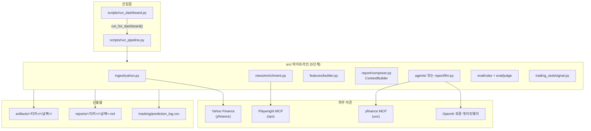
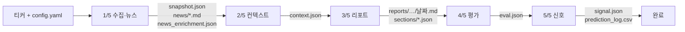
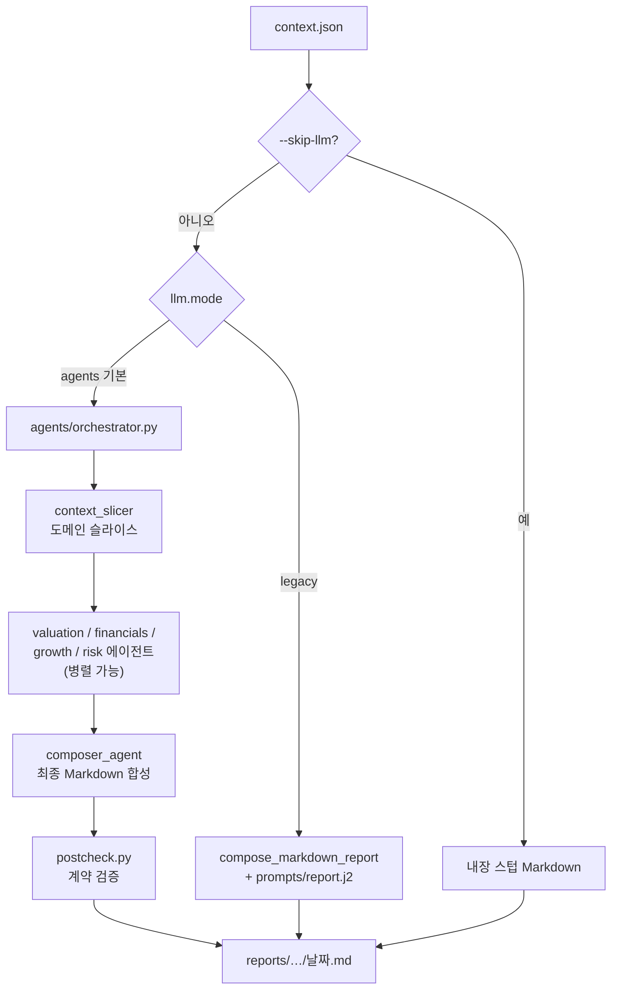
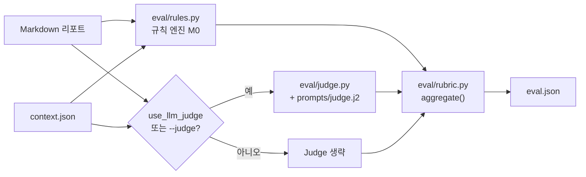
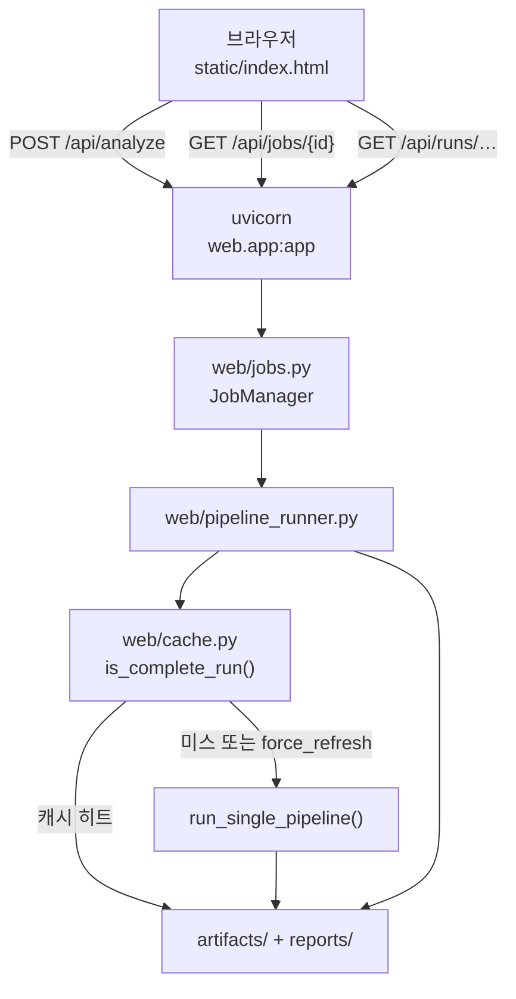

# 시스템 아키텍처

Financial AI는 **단일 파이프라인 오케스트레이터**(`scripts/run_pipeline.py`)가 `src/` 라이브러리 모듈을 순서대로 호출하는 **소규모 엔드투엔드 시스템**입니다. CLI와 웹 대시보드는 동일한 `run_single_pipeline()` 함수를 공유합니다.

---

## 전체 구성도

---

## 5단계 데이터 흐름

콘솔 로그 **`[pipeline] 1/5 ~ 5/5`** 와 1:1로 대응합니다.

### 단계별 상세

| 단계 | 모듈 | 입력 | 출력 |
|------|------|------|------|
| **1/5** | `ingest/yahoo.py`, `news/enrichment.py` | 티커, `config.yaml` | `snapshot.json`, `news/*.md`, `news_enrichment.json` |
| **2/5** | `features/builder.py`, `report/composer.py` | 스냅샷·뉴스 digest | `context.json` (LLM용 통합 컨텍스트) |
| **3/5** | `agents/orchestrator.py` (기본) 또는 `report/llm.py` (legacy) | `context.json` | `reports/<티커>/<날짜>.md`, agents 시 `artifacts/.../sections/` |
| **4/5** | `eval/rules.py`, `eval/judge.py` (선택) | 리포트 + context | `eval.json` (루브릭 점수·등급) |
| **5/5** | `trading_stub/signal.py` | 리포트 + eval | `signal.json`, `tracking/prediction_log.csv` 한 줄 |

저장 경로는 `config.yaml`의 `paths.*` 와 `paths_for_date()` (`scripts/run_pipeline.py`)가 결정합니다.

---

## LLM 리포트 분기 (`llm.mode`)

### Agents 모드 (기본)

- **도메인 에이전트**: `valuation_agent`, `financials_agent`, `growth_agent`, `risk_agent` — 각각 `src/agents/prompts/*.md` 지시문 사용
- **컴포저**: `composer_agent.py`가 섹션별 출력을 하나의 Markdown 리포트로 합성
- **ETF 분기**: `metadata.asset_type`이 ETF/FUND 등이면 `holdings_agent` + `etf_composer_agent` 경로
- **MCP 보강**: `agents/mcp_servers.py`가 `uvx yfmcp` stdio 서버를 띄워 도구 호출 (실패 시 경고 후 컨텍스트만으로 진행)
- **검증**: `postcheck.py`가 섹션 헤더·PER·밸류 산식·출처 등 계약 준수 여부 확인

### Legacy 모드

- `prompts/report.j2` + `report/llm.py` 단일 Chat Completions 호출
- Judge도 동일 `LLMProvider` 경로 사용

---

## 평가 아키텍처

- **M0 (rules-only)**: 출처 투명성·리스크·예측 검증 등 3항목 (+ ETF 전용 항목)
- **M2 (full)**: M0 + LLM Judge 6항목 → 100점 스케일
- 설정: `config.yaml` → `eval.use_llm_judge`, CLI `--judge` / `--no-judge`

---

## 웹 대시보드 아키텍처

### 주요 API (`src/web/app.py`)

| 엔드포인트 | 역할 |
|------------|------|
| `GET /api/health` | 서버 생존 확인 |
| `GET /api/info` | 공개 URL·모드·면책 문구 |
| `POST /api/analyze` | 백그라운드 Job 생성 → 파이프라인 실행 |
| `GET /api/jobs/{id}` | 진행 로그·결과 폴링 |
| `GET /api/runs/{ticker}/{date}` | 디스크 산출물 로드 |
| `GET /api/history` | 최근 실행 목록 |
| `GET /api/cache/{ticker}` | 캐시 완료 여부 |
| `GET /api/visitors` | 접속 IP·최근 요청 (근사) |

### 프론트엔드 (`src/web/static/`)

| 파일 | 역할 |
|------|------|
| `index.html` | 레이아웃·폼·탭 컨테이너 |
| `app.js` | Job 폴링, 4개 탭 렌더링, URL 해시 `#티커/날짜` |
| `report_parser.js` | Markdown → 요약·섹션 카드 파싱 |
| `chart_view.js` | TradingView Lightweight Charts 캔들 차트 |
| `style.css` | UI 스타일 |

### 공개 터널 (`--public`)

`scripts/run_dashboard.py --public` 실행 시:

1. uvicorn을 `127.0.0.1:8765`에 기동
2. `web/tunnel.py`가 `cloudflared tunnel --url` quick tunnel 실행
3. `https://….trycloudflare.com` URL을 콘솔·`logs/dashboard.public_url`에 기록
4. `DASHBOARD_PUBLIC_URL` 환경변수 → `/api/info` → UI 헤더 「공개 링크」

---

## 모듈 맵 (`src/`)

| 패키지 | 책임 |
|--------|------|
| `ingest/` | Yahoo Finance 스냅샷 수집 |
| `news/` | 뉴스 후보 선정·Playwright deep-read·digest |
| `features/` | 수익률·밸류·VIX·기술 지표 등 파생 피처 |
| `report/` | ContextBuilder, legacy LLM, 게이트웨이 클라이언트 |
| `agents/` | OpenAI Agents SDK 오케스트레이션·도메인 에이전트·MCP·postcheck |
| `eval/` | 규칙 채점·LLM Judge·루브릭 집계 |
| `trading_stub/` | 리포트에서 의견·신뢰도 추출 → 신호 JSON |
| `fio/` | JSON/CSV 저장 유틸 (표준 `io`와 이름 충돌 방지) |
| `web/` | FastAPI 데모 대시보드·캐시·Job·터널 |

---

## 설정 흐름

`config.yaml` → `load_config()` → 각 모듈이 필요한 섹션 참조.

주요 키:

| 섹션 | 용도 |
|------|------|
| `llm.*` | 모드·모델·게이트웨이 URL·API 키 환경변수명 |
| `agents.*` | 병렬 실행·MCP 도구·토큰 예산 |
| `mcp.playwright` | 뉴스 deep-read MCP 커맨드·타임아웃 |
| `mcp.yfinance` | Agents 보강용 yfinance MCP |
| `ingest.*` | 가격 기간·뉴스 개수·VIX·재시도 |
| `eval.*` | LLM Judge on/off·Judge 파라미터 |
| `paths.*` | artifacts / reports / tracking 경로 |

API 키는 `.env` 또는 `api_guide/.env`의 `OPENAI_API_KEY`만 사용합니다.

---

## 배치·백그라운드 실행

- **CLI 배치**: `--tickers`, `--tickers-file` → 티커 루프, 요약 `artifacts/_batch/<날짜>/batch_summary.json`
- **launchd 배포**: `scripts/deploy_local.sh` → `com.financialai.dashboard` 서비스 (`--public` 포함)

---

## 관련 문서

- [FEATURES.md](FEATURES.md) — 기능별 사용자 설명
- [DEMO_GUIDE.md](DEMO_GUIDE.md) — 발표 당일 실행·시연
- [SOURCE_MAP.md](SOURCE_MAP.md) — 파일·폴더 역할
- [ONBOARDING.md](ONBOARDING.md) — 개발자 확장 가이드
